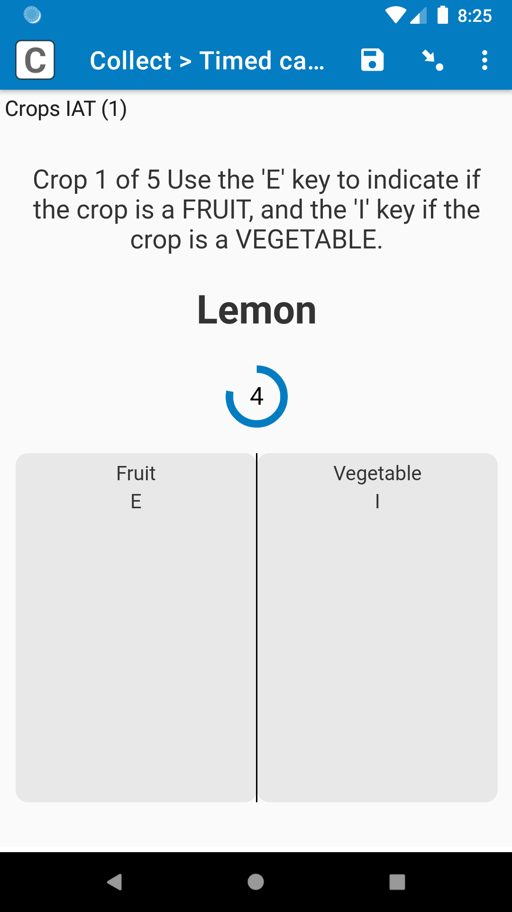
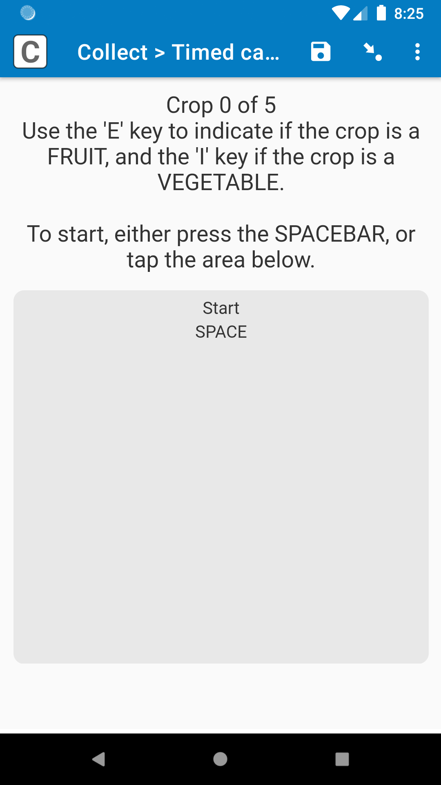
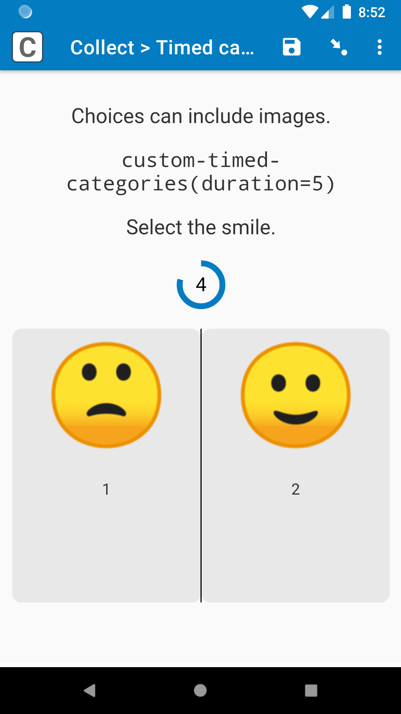
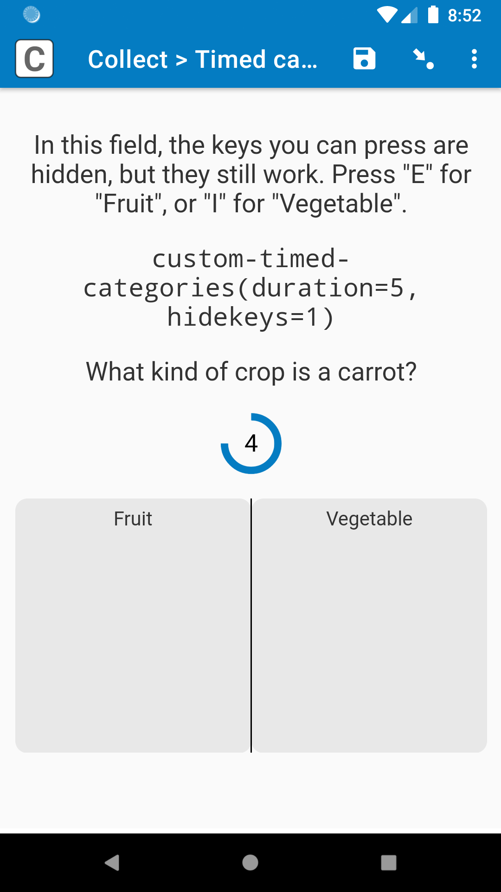
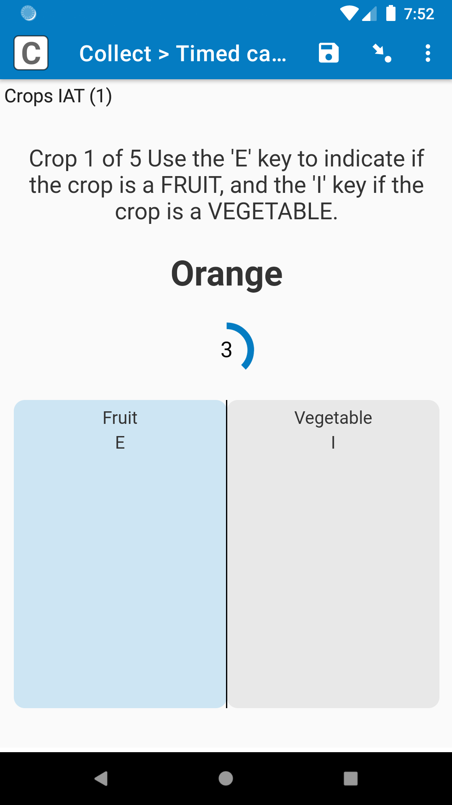
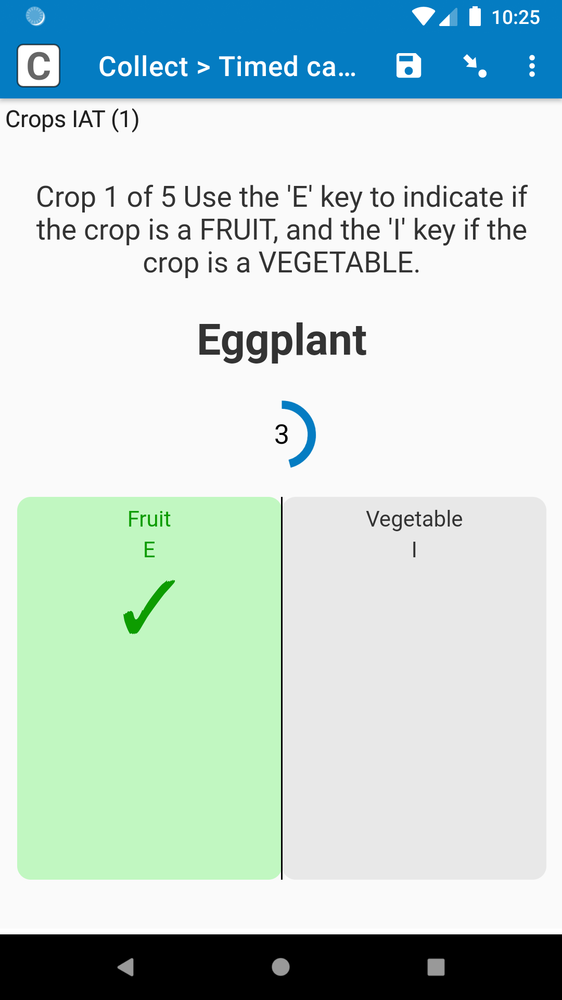
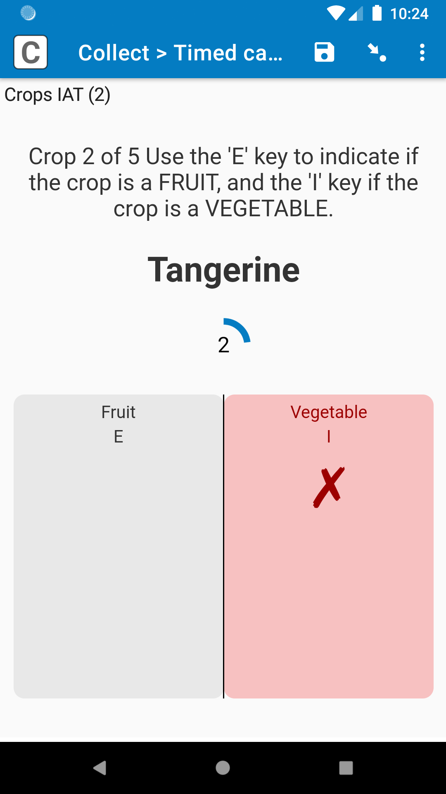
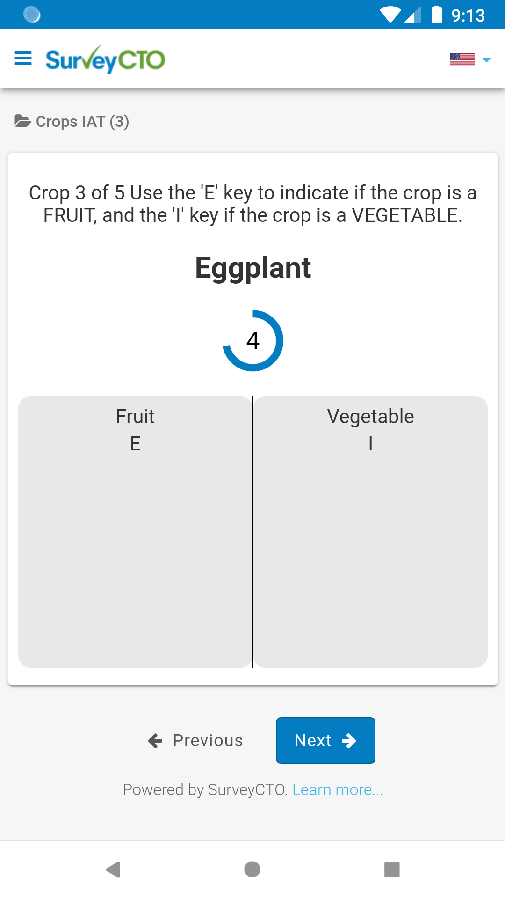
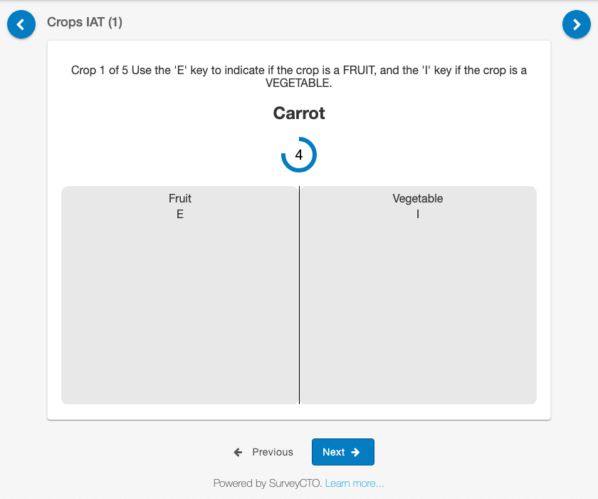

# Timed categories

|  |  |  |  |
|:---:|:---:|:---:|:---:|
| No timer | Choice images | Hide keys | Randomized |

|  |  |  |
|:---:|:---:|:---:|
| Choice selected | Right selected | Wrong selected |

|  |  |
|:---:|:---:|
| Web view on mobile | Web view on desktop |

## Description

This field plug-in presents a number of choices as columns, and the respondent can select a choice using either a keyboard key, or tapping the area below the choice. They must select a choice within a certain period of time, or the field will be marked as "passed".

Great for implicit association tests (IAT)!

We will also be hosting a webinar about this field plug-in and IAT on **Wednesday, October 6, 2021, at 1 PM UTC / 9 AM EST**. You can learn more and register at [this blog post](https://www.surveycto.com/events/implicit-association-test-webinar/).

*This plug-in is currently under beta. If you you find a problem with the field plug-in, please email support@surveycto.com.*

### Features

* Timer with customizable start time and units (seconds, deciseconds, centiseconds, and milliseconds) (optional).
* Auto-advances after choice is selected or time runs out.
* Can select a choice using either the corresponding keyboard key, or clicking/tapping its choice column (both optional).
* Field is given a "pass" value if a choice is not selected in time.
* Show if the selected choice is the correct choice (optional).
* Display the keyboard key corresponding with each choice (optional).
* If the respondent selects a choice they didn't mean to, and there was time remaining, they can go back and correct it (optional).
* Supports images for both the field and choices.

To learn how to customize the field plug-in, check out the [parameters](#parameters) below, as well as the [more tips](#more-tips) section.

### Data format

The field will have a value of the selected choice, or the value of the "pass" choice (discussed more [later](#setting-up-the-choice-list)) if a choice is not selected in time.

#### Metadata

Metadata is stored in space-separated list. The first two items in the list are used for internal purposes, but if you use the `correct` [parameter](#parameters) the third item will store a `1` if the correct choice was selected, and `0` otherwise. You can retrieve that value using an expression like this:

    selected-at(plug-in-metadata(${fieldname}), 2)

You can also calculate if the response is correct or not by checking the field value, which is demonstrated in the sample form.

## How to use

### Getting started

**To use this field plug-in as-is**, just download the [timed-categories.fieldplugin.zip](https://github.com/surveycto/timed-categories/raw/main/timed-categories.fieldplugin.zip) file from this repo, and attach it to your form.

**To use with the sample form:**

1. Download the [sample form](https://github.com/surveycto/timed-categories/raw/main/extras/sample-forms/sample-main/Timed%20categories%20sample%20form.xlsx) from this repo.
1. Download the [crops_list.csv](https://github.com/surveycto/timed-categories/raw/main/extras/sample-forms/sample-main/crops_list.csv) dataset template (right-click the link, click *Save link as*, set format to *All Files*, add `.csv` to the end of the file name, and save).
1. Download the [timed-categories.fieldplugin.zip](https://github.com/surveycto/timed-categories/raw/main/timed-categories.fieldplugin.zip) file from this repo.
1. Upload the form to your server with the CSV and ZIP files attached.

You can also check out [this sample form](https://github.com/surveycto/timed-categories/raw/main/extras/sample-forms/more-options/Timed%20categories%20-%20more%20options.xlsx), which demonstrates the parameters, with [this file](https://github.com/surveycto/timed-categories/raw/main/extras/sample-forms/more-options/tc-other-attachments.zip) and the field plug-in attached.

#### Setting up the choice list

All choices in the choice list, except for the last choice, will be choices the respondent can select. Each of those choices will have a column in the field display, and they will be selectable by the respondent using either a keyboard key or by clicking.

The **last choice** will not be displayed as a column, and instead it will be the **"pass" value**. It will be automatically selected if time runs out before a choice is selected. This "pass" choice is needed even if the field is not timed.

The value of each choice will be the keyboard key to press to select that choice. For example, if a choice has a *value* of `e`, then if the respondent presses the "E" key on their keyboard, then that choice will be selected, and the field will auto-advance.

All choice values that are letters should be **lowercase** (they will be displayed in uppercase in the field, but the choice values themselves need to be lowercase). To set up a choice so it is selected when the spacebar is pressed, give that choice a *value* of `space` (this is demonstrated in field "instructions" the sample form).

### Parameters

All parameters are **optional**, but they can be used to customize the field plug-in.

#### Main parameters

These are by far the most common parameters you will use.

|Name|Description|Default|
|:---|:---|:---|
|`duration`|
How long the respondent has to answer the field until it automatically moves on to the next page. No matter the value of `unit`, the `duration` should always be defined in **seconds**. If time runs out before a choice is selected, then the "pass" value will be automatically selected and saved as the choice value.

If this is undefined, then the field will be untimed, and the timer will not appear.
|None|
|`unit`|
Unit to be used for the display time. For example, if `duration` has a value of 5, and `unit` has a value of `'cs'` for "centiseconds", then the time will start at 500, and count down to 0 over five seconds (500 centiseconds)

You can use `'s'` (seconds), `'ds'` (deciseconds), `'cs'` (centiseconds), or `'ms'` (milliseconds).
|`'s'`|
|`correct`|
If a field has a "correct" value, you can define that in this parameter. If the respondent selects the correct answer, then the selected choice will turn green, and show a checkmark. If they select the wrong answer, the selected choice will turn red, and show an X. That way, the respondent gets instant feedback.

The value of this parameter should be the same as the correct choice value, but in quotes. For example, if the correct choice has a value of `e`, then this parameter should have a value of `'e'`. Then, if the choice with a value of `e` is selected, then the selected choice will turn green; if another choice is selected, it will turn red.

This parameter is optional, so even if a field has a "correct" value, if you don't want to give immediate feedback, you can simply leave this parameter out. If this parameter is not defined, then the selected choice will turn blue, whether or not it is right.
|None|

#### Other parameters

These are other parameters you can use in your form, but they are a lot less common. They are also all **optional**.

|Name|Description|Default|
|:---|:---|:---|
|`hidekeys`|Normally, the keyboard key used to select a choice will appear below the choice label. If this parameter has a value of `1`, then it will not show those keyboard keys. This can be helpful if the form will only be completed on a mobile device, where the correct choice will only be selected by clicking/tapping.|`0`|
|`allowkeys`|Whether or not keyboard keys can be used to select a choice. If this parameter has a value of `0`, then keyboard keys cannot be used to select a choice, only clicking/tapping. It will also hide the keyboard keys usually shown below the choice labels, since they are not needed.|`1`|
|`allowclick`|Whether or not clicking/tapping a choice on the choice column can be used to select a choice. If this parameter has a value of `0`, then clicking/tapping the choice cannot be used to select a choice, only keyboard keys.|`1`|
|`continue`|
Whether or not the respondent can continue with the time they have left. For example, if the field plug-in has a `duration` of 10, and the respondent goes to the field, stays for two seconds, goes back to the previous field for five seconds, then returns to the timed-categories field, they will still have three seconds to answer the field.

If this parameter has a value of `0`, then if the respondent accidentally swipes backwards or forwards while on the field, then the field will automatically be assigned the "Pass" value.

This parameter has no effect if the `duration` is not set.
|`1`|
|`allowchange`|
Related to `continue`, by default, if the respondent answers a field, but they **still have time remaining**, then they can go back and change their answer. This can be helpful if the respondent is tapping the screen too much, accidentally answering a question before they actually get a chance to read it.

If this parameter has a value of `0`, then once a field is answered, its response cannot be changed, even if there is time remaining. This is recommended if the field has a `correct` value, so the respondent cannot correct an incorrect response.

This parameter has no effect if the `duration` is not set.
|`1`|
|`frame_adjust` (advanced)|The field plug-in has been formatted so the tappable area takes up as much of the screen as possible, but without making it so big that the page becomes scrollable. If you would like to make the clickable area bigger or smaller, use this parameter to define how many pixels it should be adjusted by. For example, to make the clickable area 50 pixels taller, give this parameter a value of `50`. To make the clickable area 10 pixels shorter, give this parameter a value of `-10`.|`0`|

For a demonstration of the parameters, deploy [this sample form](https://github.com/surveycto/timed-categories/raw/main/extras/sample-forms/more-options/Timed%20categories%20-%20more%20options.xlsx), with [this file](https://github.com/surveycto/timed-categories/raw/main/extras/sample-forms/more-options/tc-other-attachments.zip) and the field plug-in attached.

### More tips

* If the form is going to be completed as a [web form](https://docs.surveycto.com/03-collecting-data/02-web-data-collection/01.web-forms.html), for the Collect settings, you may want to set *Disable swipe navigation* to *ON*. That way, if the respondent's finger slips while completing the form on mobile, they will not accidentally swipe backwards to the last field. To adjust web form settings, on the Collect tab of your server console, go to the form, and click *Settings*.
* You can use the ["randomized" *appearance*](https://docs.surveycto.com/02-designing-forms/01-core-concepts/03h.field-types-select-one.html) to randomize the order of the choice columns. However, the last choice in the choice list is always going to be the "pass" value, and not appear as a column. To make sure the last choice is always last, use the `randomized(0, 1)` *appearance*.
* If you are going to use a `unit` other than seconds, it is a good idea to tell the respondent before they start the test, so they are prepared, and they can focus on the test.

<!--
* If you do not like the size of the timer circle, the colors, or something else, you can change the field plug-in files. Check out our guide on [customizations](extras/customizations/customizations.md).
-->

### Default SurveyCTO feature support

| Feature / Property | Support |
| --- | --- |
| Supported field type(s) | `select_one` |
| Default values | No |
| Custom constraint message | No |
| Custom required message | No |
| Read only | Yes |
| media:image | Yes |
| media:audio | Yes |
| media:video | Yes |
| `label` appearance | No |
| `list-nolabel` appearance | No |
| `quick` appearance | No |
| `minimal` appearance | No |
| `compact` appearance | No |
| `compact-#` appearance | No |
| `quickcompact` appearance | No |
| `quickcompact-#` appearance | No |
| `likert` appearance | No |
| `likert-min` appearance | No  |
| `likert-mid` appearance | No |

## More resources

* **Sample form 1**  
You can find the main form definition [here](https://github.com/surveycto/timed-categories/raw/main/extras/sample-forms/sample-main/Timed%20categories%20sample%20form.xlsx). You will also need the [crops_list.csv file](https://github.com/surveycto/timed-categories/raw/main/extras/sample-forms/sample-main/crops_list.csv).

* **Sample form 2**  
You can find the other form definition [here](https://github.com/surveycto/timed-categories/raw/main/extras/sample-forms/more-options/Timed%20categories%20-%20more%20options.xlsx). You will need to attach [this file](https://github.com/surveycto/timed-categories/raw/main/extras/sample-forms/more-options/tc-other-attachments.zip).

* **Developer documentation**  
More instructions for developing and using field plug-ins can be found here: [https://github.com/surveycto/Field-plug-in-resources](https://github.com/surveycto/Field-plug-in-resources)