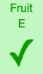
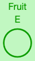
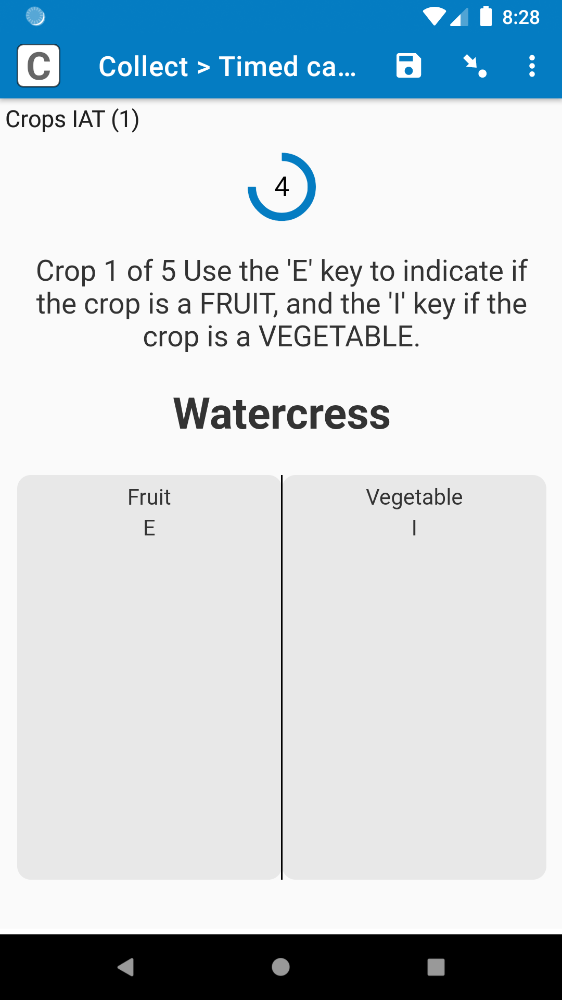

# Customizations

The timed-categories field plug-in has lots of parameters, so you can customize it to fit your needs. However, you can also change the field plug-in itself to customize its appearance. Here, we discuss some of the most common and easier changes you can make to this field plug-in.

For help making customizations to the field plug-in, check out our support article on [customizing field plug-ins](). Even if you have never used CSS or HTML before, you can follow the steps described here to customize the field plug-in.

We have a lot of suggestions on this page, but feel free to just focus on the adjustments you would like to use, ignoring the others.

## Common adjustments

|||
|:---:|:---:|
|Standard|Purple (`#811eb3`)|

If you look at the **style.css** stylesheet, there are lots of rulesets that customize the appearance of the field plug-in, such as applying different colors. Here are the ones you are most likely to change:

|Ruleset|Description|
|:---|:---|
|**svg.timer-shell&nbsp;.timer-circle**|The circle around the timer that slowly shrinks. You can change the **stroke** to change the color of the circle. If you would like to change how thick the circle see [adjusting timer size](#adjusting-timer-size) below.|
|**.timer**|Number inside the timer circle. If you would like to change the size of the number, see [below](#timer-number).|
|**td.tapped**|If the `correct` [parameter](../../README.md) is not defined, then this is the styling that will be applied to a choice when it is selected. Currently, it only changes the background color, but if you add a **color** property, that can be used to change the font color.|
|**td.correct**|Style applied to a choice when it is selected, and its choice value is the value defined in the `correct` parameter.|
|**td.wrong**|Style applied to a choice when it is selected, and its choice value is *not* the value defined in the `correct` parameter.|
|**div.correct-symbol**|Size of the symbol shown when the choice selected is right or wrong (currently a checkmark or an X).|

## Adjusting timer size

### Timer circle

|||
|:---:|:---:|
|Standard|Smaller, thicker|

If you would like the timer circle to be bigger or smaller, follow these steps:

1. Determine what you would like the outer diameter of the circle to be, in pixels.
1. Open the **style.css** file.
1. Within the `:root` ruleset near the top, change the **--timer-diameter** value to the diameter you want, followed by `px`. For example, if the diameter of the circle should be 40 pixels, the **--timer-diameter** should be `40px`.
1. If you would also like to change the border width of the circle (to make it thicker or thinner), change the  **--stroke-width**.
1. Calculate the "r" (radius) value, which will be used soon. Take the **--timer-diameter**, subtract the **--stroke-width**, divide that by 2, and round down to the nearest whole number. For example, if the **--timer-diameter** is `40px`, and the **--stroke-width** is `8px`, then the "r" value is `16px`.

        r = (timer-diameter - stroke-width) / 2

1. Open the **template.html** file.
1. Go to this row:

        <circle class="timer-circle" cx="50%" cy="50%" r="22px" />

1. Within that line of HTML, set the "r" attribute to the "r" value you calculated in step 5. For example, if the radius you calculated is `16px`, then the row should look like this:

        <circle class="timer-circle" cx="50%" cy="50%" r="16px" />

### Timer number

|||
|:---:|:---:|
|Standard|Font 32px|

To change the font size of the timer number, within the **:root** ruleset, simply change the **--timer-font**. It is important that you change it there instead of in another ruleset, since other adjustments are based on the font size.

**Optional**: If you change the timer number font size, the vertical alignment of the number in the circle might be off by one pixel (if you look at the screenshot above, the 32px timer number is 1 pixel higher than it should be). To adjust this, go to the **.timer** ruleset. There is a declaration that looks like this:

    margin-top: calc((var(--timer-font) - (var(--timer-diameter)*0.8 + 3px)) * -0.58);

That may look complex, but you can ignore most of it: focus on the `3px` part. To move the timer number **up**, you can **decrease** that value. To move the number **down**, you can **increase** that value.

Of course, most respondents will not notice this, and you can usually leave it alone. 

## Change the correct/wrong symbols

|||
|:---:|:---:|
|Standard correct|Circle correct|

You can also change the checkmark that appears when an answer is correct, as well as the X that appears when an answer is wrong. This is a bit more advanced, but it is still definitely doable for a novice.

Open the **script.js** file. Search for and find the two instances of `checkElement.appendChild(` (as of this writing, they are on rows 178 and 182, but that may have changed since this page was last updated). These rows are where those characters are defined.

This row makes the "correct" symbol a checkmark:

    checkElement.appendChild(document.createTextNode(String.fromCharCode(0x2713)))

And this row makes the "wrong" symbol a checkmark:

    checkElement.appendChild(document.createTextNode(String.fromCharCode(0x2717)))

`0x2713` is the Unicode reference for a checkmark, and `0x2717` is the Unicode reference for an X symbol. Both are part of the Dingbats character set, and you can find other characters in that set [here](https://en.wikibooks.org/wiki/Unicode/Character_reference/2000-2FFF).

If you would like to use different characters, you can simply update the Unicode references. For example, if you would like to use a circle, you can use `0x25EF`.

To find the Unicode reference you should use, you can simply perform a web search for "unicode" followed by the kind of symbol you are looking for, and use the code you find. When you enter the reference into the script.js file, make sure it starts with `0x`, followed by the four-character code you find (when you find it, it is sometimes proceeded by "U+", but don't include that in the script.js file).

If you are going to use basic characters that you can find on most keyboards, such as `Y` or `N`, you can simply use those in quotes without the Unicode reference, like this:

    checkElement.appendChild(document.createTextNode('Y'))

## Moving the timer

|||
|:---|:---|
|Standard|Timer top

Currently, the timer is below the field label, hint, and any media you might have in the field, and above the choice columns, but if you'd like, you can move it to another part of the form.

Open the **template.html** file. There, look for this code:

    

      <svg class="timer-shell">
        <circle class="timer-circle" cx="50%" cy="50%" r="22px" />
      </svg>
      
    

That is the definition of the timer. You can cut that out of the HTML file, and paste it somewhere else. For example, if you want it at the very top, above even the field label, you can paste it in at the top of the file. If you want it below the label, but above the media, put it below this part:

    
{{{LABEL}}}

But above this part:

    {{#MEDIAIMAGE}}
    
    {{/MEDIAIMAGE}}